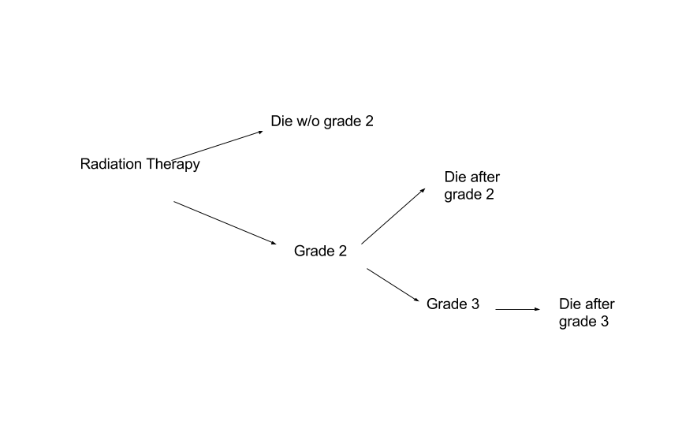
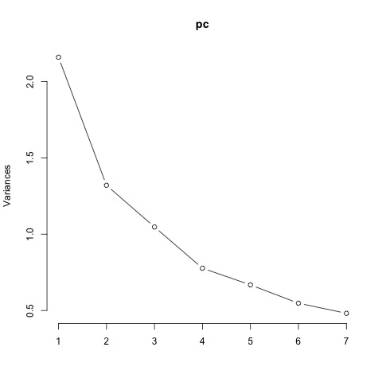
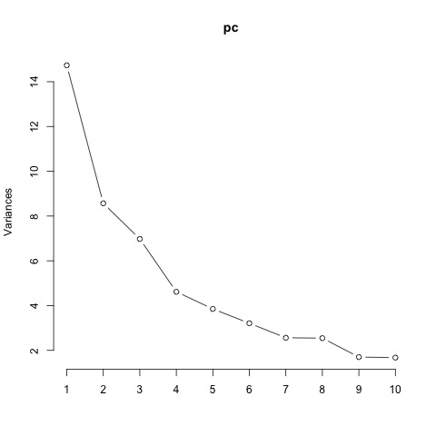
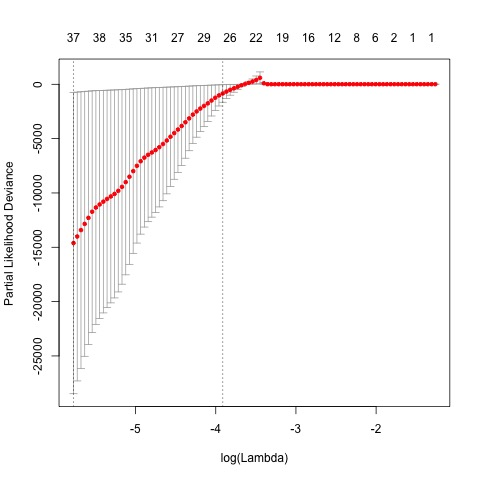

```{r, message=FALSE, warning=FALSE, include=FALSE, results="hide"}
library(data.table)
library(readxl)
```

## Description of Data
- 63 patients with lung cancer who received radiotherapy
- 62 microRNA expression variables



## Study aims
- Predict time to grade 3 (grade 2) cardiac events
- Determine if biomarkers improve prediction over the original predictors

## Things to worry about
1. Sample size: one predictor per 10 events? 
    + 7 truly censored
    + 11 grade 3 observations
    + 28 grade 2 or more (includes grade 3)
2. What do we do if grade 2 event and death in the same month? No cause of death variable
    + subject 18 has this
    + subject 49 appears to die before having a grade 2 event
3. Two types of people: those with Framingham risk score and those without
    + subject 1 missing lots of data
4. Competing risk: 28 out of the 63 people die without experiencing either Grade2 or Grade3
5. How do you assess a cox regression model fit?
6. Feature selection in a cox regression model

## Gender imbalance
|  | level | Female | Male | p |
|-------------------------------------------------------------------|-------|---------------|--------------|--------|
| n |  | 15 | 48 |  |
| Age (mean (sd)) |  | 61.95 (10.06) | 67.79 (9.36) | 0.043 |
| Heart mean dose (mean (sd)) |  | 11.51 (7.78) | 14.40 (9.02) | 0.268 |
| Framingham Risk Score (mean (sd)) |  | 4.54 (3.57) | 18.23 (7.09) | <0.001 |
| Grade 3 (%) | 0 | 14 (93.3) | 38 (79.2) | 0.383 |
|  | 1 | 1 ( 6.7) | 10 (20.8) |  |
| Grade 2 (%) | 0 | 12 (80.0) | 23 (47.9) | 0.059 |
|  | 1 | 3 (20.0) | 25 (52.1) |  |
| Pre-existing cardiac | 0 | 13 (86.7) | 31 (64.6) | 0.192 |
|  | 1 | 2 (13.3) | 17 (35.4) |  |

## Basic model
- Ignored grade 3
- Assume grade 2 is absorbing
- Each state essentially ignores the other states and is wrong individually
- Cox regression
    + Outcome: time to event
    + Predictors: heart mean dose, Gender, Age, total chol, hdl chol, systolic bp, current smoker, hbp treatment, pre-existing cardiac disease

## Basic Model Results
- Concordance= 0.774  (se = 0.062 )
- Rsquare= 0.378   (max possible= 0.953 )
- Likelihood ratio test= 29.5  on 9 df,   p=0.000538

|   | term                                               | estimate | std.error | p.value |
|---|----------------------------------------------------|----------|-----------|---------|
| 1 | heart_Meandose                                     | 0.069    | 0.022     | 0.002   |
| 2 | Gender.M.FM                                        | 2.020    | 0.755     | 0.007   |
| 3 | Age                                                | -0.025   | 0.023     | 0.293   |
| 4 | Total.Chol..btw.130.320..                          | -0.007   | 0.008     | 0.380   |
| 5 | HDL.Chol..btw.20.100..                             | 0.042    | 0.022     | 0.058   |
| 6 | Systolic.BP..btw.20.190..                          | 0.027    | 0.013     | 0.033   |
| 7 | Current.Smoker.0.no..1.yes                         | -0.510   | 0.517     | 0.324   |
| 8 | HBP.Treated.0.no..1.yes..on.meds..                 | 0.013    | 0.516     | 0.980   |
| 9 | Pre.Existing.Cardiac.Disease..CADorCHF..0.no.1.yes | 0.235    | 0.519     | 0.651   |


## Principal components basic model
|  | PC1 | PC2 | PC3 | PC4 | PC5 | PC6 | PC7 |
|------------------------|------|------|------|------|-------|-------|-------|
| Standard deviation | 1.47 | 1.15 | 1.02 | 0.88 | 0.817 | 0.740 | 0.694 |
| Proportion of Variance | 0.31 | 0.19 | 0.15 | 0.11 | 0.095 | 0.078 | 0.069 |
| Cumulative Proportion | 0.31 | 0.50 | 0.65 | 0.76 | 0.853 | 0.931 | 1.000 |



## Principal components basic model results
- Cox regression
    + Outcome: time to event
    + Predictors: heart mean dose, Gender, framPC1, framPC2, framPC3, framPC4

- Concordance= 0.782  (se = 0.062 )
- Rsquare= 0.345   (max possible= 0.953 )
- Likelihood ratio test= 26.26  on 6 df,   p=0.0001994

|  | term | estimate | std.error | p.value |
|---|----------------|----------|-----------|---------|
| 1 | heart_Meandose | 0.07 | 0.02 | 0.001 |
| 2 | Gender.M.FM | 1.93 | 0.71 | 0.007 |
| 3 | framPC1 | -0.03 | 0.17 | 0.864 |
| 4 | framPC2 | 0.32 | 0.19 | 0.085 |
| 5 | framPC3 | 0.47 | 0.23 | 0.040 |
| 6 | framPC4 | 0.18 | 0.23 | 0.434 |

## Principal components for microRNA variables
|  | PC1 | PC2 | PC3 | PC4 | PC5 | PC6 | PC7 | PC8 | PC9 | PC10 |
|------------------------|------|------|------|-------|-------|-------|-------|-------|-------|-------|
| Standard deviation | 3.84 | 2.93 | 2.64 | 2.149 | 1.962 | 1.792 | 1.601 | 1.596 | 1.304 | 1.295 |
| Proportion of Variance | 0.24 | 0.14 | 0.11 | 0.074 | 0.062 | 0.052 | 0.041 | 0.041 | 0.027 | 0.027 |
| Cumulative Proportion | 0.24 | 0.38 | 0.49 | 0.563 | 0.625 | 0.677 | 0.718 | 0.759 | 0.787 | 0.814 |



## microRNA model with just PC's
- 8 PC's
- Concordance= 0.698  (se = 0.062 )
- Rsquare= 0.232   (max possible= 0.953 )
- Likelihood ratio test= 16.34  on 8 df,   p=0.03783

| term | estimate | std.error | p.value |
|------|----------|-----------|---------|
| PC1  | -0.146   | 0.1       | 0.1     |
| PC2  | -0.057   | 0.1       | 0.6     |
| PC3  | 0.283    | 0.4       | 0.5     |
| PC4  | 0.006    | 0.1       | 1.0     |
| PC5  | 0.042    | 0.6       | 0.9     |
| PC6  | -0.428   | 0.4       | 0.3     |
| PC7  | -0.136   | 0.2       | 0.5     |
| PC8  | -0.030   | 0.1       | 0.8     |


## Full model 
- Concordance= 0.816  (se = 0.062 )
- Rsquare= 0.425   (max possible= 0.953 )
- Likelihood ratio test= 34.32  on 14 df,   p=0.001852

| term           | estimate | std.error | p.value |
|----------------|----------|-----------|---------|
| heart_Meandose | 0.08     | 0.02      | 0.001   |
| Gender.M.FM    | 1.48     | 0.79      | 0.060   |
| framPC1        | 0.02     | 0.20      | 0.917   |
| framPC2        | 0.18     | 0.19      | 0.327   |
| framPC3        | 0.37     | 0.24      | 0.131   |
| framPC4        | 0.07     | 0.25      | 0.782   |
| PC1            | -0.06    | 0.09      | 0.523   |
| PC2            | -0.04    | 0.11      | 0.688   |
| PC3            | 0.22     | 0.25      | 0.372   |
| PC4            | -0.11    | 0.11      | 0.319   |
| PC5            | 0.10     | 0.29      | 0.727   |
| PC6            | -0.06    | 0.25      | 0.806   |
| PC7            | -0.05    | 0.19      | 0.798   |
| PC8            | -0.19    | 0.15      | 0.214   |

## Likelihood ratio test comparing models
Analysis of Deviance Table

- Model 1: ~ heart_Meandose + Gender.M.F + framPC1 + framPC2 + framPC3 + framPC4
- Model 2: ~ heart_Meandose + Gender.M.F + framPC1 + framPC2 + framPC3 + framPC4 + PC1 + PC2 + PC3 + PC4 + PC5 + PC6 + PC7 + PC8

|   | loglik | statistic | df | p.value |
|---|--------|-----------|----|---------|
| 1 | -82    | NA        | NA | NA      |
| 2 | -78    | 8         | 8  | 0.4     |

- No improvement

## Lasso
- glmnet package
- cox regression with lasso penalty, 10-fold CV
- Does not subset very well; want the line to go down and minimize at a lower feature count




## Conclusions and things to look into
Conclusions--if you ignore everything and only look at Grade 2:

- Adding the biomarkers does not signficantly improve model performance
- There is no good subset of predictive biomarkers

Look into:

- Assessing model fit somehow (rms package)? Cross-validate
- Cumulative incidence curves and plots in general
- Do something about the competing risk that isn't essentially nothing
- Base model fit using non-biomarker data could probably be improved
- Grade 3 


## Links:
1. https://cran.r-project.org/web/views/Survival.html
2. http://www.framinghamheartstudy.org/risk-functions/coronary-heart-disease/hard-10-year-risk.php
3. http://www.hematologialafe.es/DOCUMENTOS_D/SESION%20LECTURA%20CRITICA/SCRUCCA_L_BMT2009359B.PDF
4. https://github.com/dylanfsun/699project3

